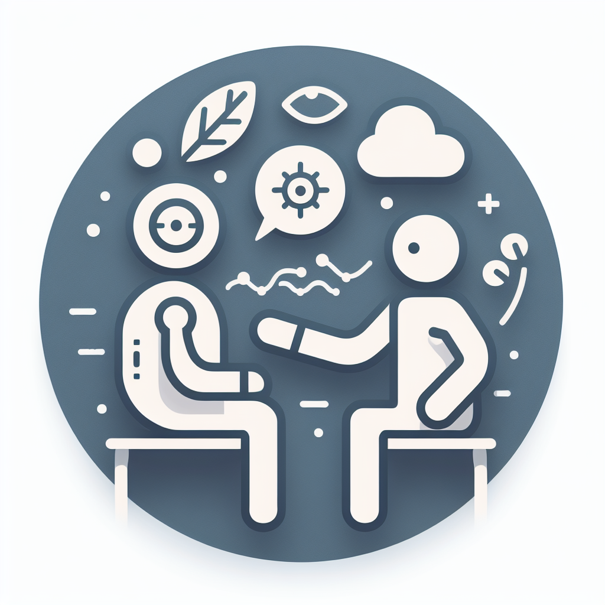
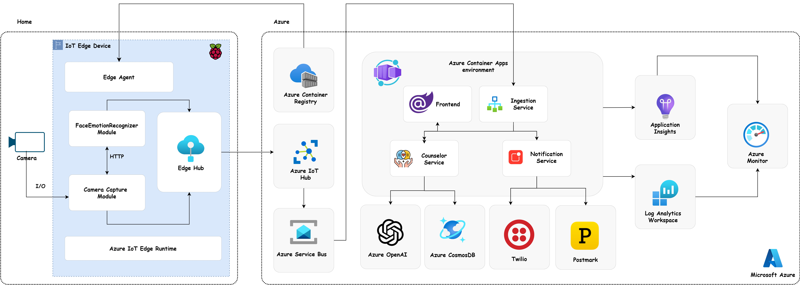
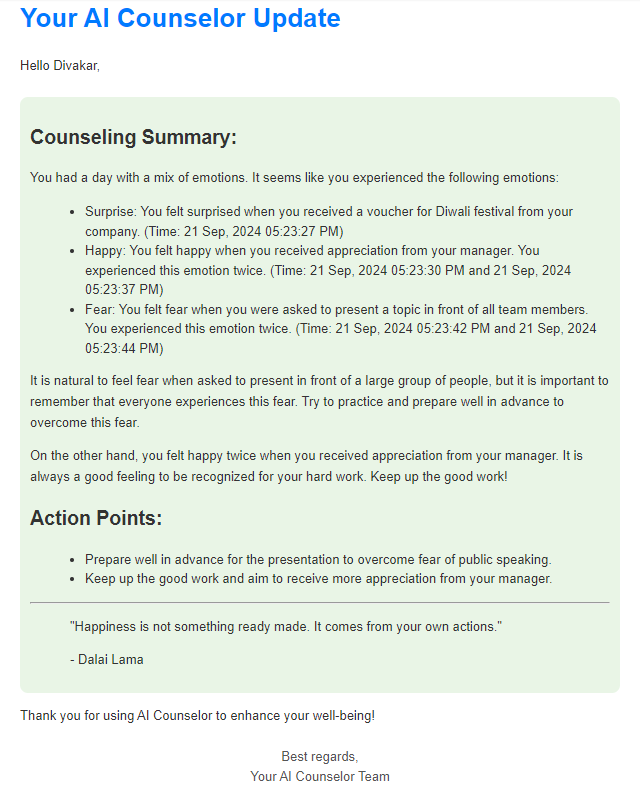

    <a href="https://iamdivakarkumar.com/" target="blank" style="text-decoration: none; color: black;">        
        

         
        

    </a>      

    <b>AI Counselor is your daily companion that tracks your emotions and provides you with a summary along with action points at the end of the day</b>

 

# Inspiration
In the fast-paced realm of work, we often neglect our mental well-being, giving rise to various challenges. To address this, I've introduced a solution that leverages AI.

- The AI Counselor app goes beyond traditional emotion tracking tools. It harnesses the power of artificial intelligence to offer real-time counseling tailored to the unique emotional challenges individuals encounter in their professional journeys.

- This innovative app seamlessly integrates into users' daily routines, discreetly capturing emotional nuances through IoT edge and custom vision technology. As users navigate the ups and downs of their workday, the AI Counselor analyzes emotional patterns and delivers personalized counseling strategies directly to their mailbox at the end of the day.

 </img>

Generated by DALL·E

- The app doesn't merely identify emotions; it takes a proactive approach by providing actionable insights and well-being recommendations. This empowers users to navigate their professional landscapes with resilience and emotional intelligence.

- The AI Counselor represents a paradigm shift in promoting mental health in the workplace. It serves as a virtual counselor that is not only empathetic but also equipped with the precision of artificial intelligence, fundamentally reshaping how we approach emotional well-being in our professional lives.

## Architecure

## Data Flow

1. The CameraCapture Edge Module enables continuous capture from a USB camera at a rate of one frame per second.
2. The captured images are subsequently transmitted to the FaceEmotionRecognizer Edge Module through an HTTP call.
3. The FaceEmotionRecognizer module returns the probability of facial emotions to the CameraCapture module.
4. The CameraCapture module is responsible for aggregating emotions obtained from the FaceEmotionRecognizer module.
5. Once a specified threshold is reached, the aggregated telemetry data is then pushed to the Azure IoT Hub.
6. The data, through route endpoints are subsequently pushed from Azure IoT Hub to Azure Service Bus.
7. The ingestion Service listens for messages in the Azure Service Bus and, upon their placement, initiates an HTTP call to the Counselor service.
8. The Counselor service stores the telemetry data into Azure Cosmos DB.
9. Simultaneously, if a specific emotion persists for more than n seconds, the ingestion service, following the defined business logic, initiates an HTTP call to the Notification service. Subsequently, the Notification service sends an SMS to the user, prompting them to provide a reason in the Frontend app.
10. The ingestion service is scheduled to run daily at 12 AM, triggering the Counselor Service. The Counselor Service then initiates an HTTP call to the Azure OpenAI service, including the telemetry data collected throughout the day.
11. The Azure OpenAI service furnishes a counseling summary, and this information is subsequently transmitted to the ingestion service.
12. With the counseling summary in place, the ingestion service initiates an HTTP call to the Notification service, which, in turn, dispatches an email template containing the summary to the user.

# AI Counselor Summary

The counseling summary is structured into four key elements:

<b>1. General Emotion Overview:</b> The summary initiates by offering a broad overview of the emotions experienced throughout the day. 
<b>2. Contextual Explanations:</b> Following the emotion overview, the summary provides possible explanations, taking into account the context and reasons shared by the user through our app. 
<b>3. Action Points for Overcoming Challenges:</b> Subsequently, actionable points are presented to assist users in navigating and overcoming any challenges identified during the emotional analysis. 
<b>4. Motivational Quote Conclusion:</b> The counseling summary concludes with a carefully selected motivational quote, personalized to the user's emotions. This aims to provide a positive and uplifting note, wrapping up the email. 

 
 

 

  

# Screenshots

<b> .NET Aspire Dashboard </b>

<b> Landing Page </b>

<b> Track Emotions Page </b>

